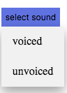

# Experiment	Procedure	Documentation

**Introduction**
This	document	captures	the	instructions	to	run	the	experiment.

**Instructions**

1. To run the experiment, simply run the voiced.html file by clicking on it and the experiment	will	open	in	the	browser.

2. 	Select the track by clicking on the option select sound.

3. The selected sound track will be displayed on the browser.

4. Select the windowed waveform by dragging the mouse cursor. 

4. Click on the generate button to generate the LPC waveforms.

5. The Windowed Waveform, Autocorrelation signal, LP log Spectrum, Log Spectrum for the sound sample will be generated.

6. Select the desired sound sample from drop-down button to observe the different signals.
 
   
